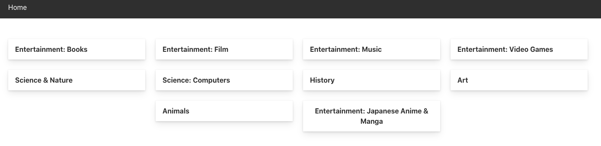
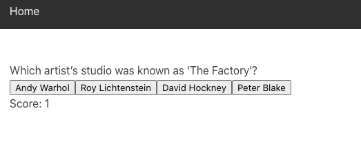

#  GA London React Template

`yarn start` to run the development server

`yarn build` to create a build directory


This project was bootstrapped with [Create React App](https://github.com/facebook/create-react-app).

# General Knowedge Quiz - GA Project Two 


 
### Goal and timeframe 

- The second project was pair coded hackathon; 48 hours to create a React app that consumed a public API.

### Technologies Used

- React.js
- JavaScript
- HTML5 
- SCSS
- Axios
- Yarn 
- Bulma 
- Insomnia 

### Process

We started by searching for a free public API to use without an access key. After we had found our General Knowledge API we hooked it up to Insomnia and starting making REST request to make sure we would access the data we needed. We thought this was a great opportunity to experience pair coding. We approached it thus: switching who was typing every hour and talking through the next steps before actually writing any code.  

- Created a wireframe for the quiz including pseudo code for the correct/wrong answers logic.
- Building out our components for the quiz: homepage, quiz and results.
- Building out logic for the quiz.

- Accessing the categories we wanted and mounting them.
```
async componentDidMount() {
    const response = await getAllCategories()
    const filterResponse = response.data.trivia_categories.filter(category => (category.id === 12 || category.id === 10 || category.id === 15 || category.id === 17 || category.id === 18 || category.id === 23 || category.id === 25 || category.id === 27 || category.id === 31 || category.id === 11))
    this.setState({
      categories: filterResponse
    })
  }
```

### Challenges 
- Accessing the data; this was a challenge due to the data being very embedded. We spent a lot of time breaking down the code trying to access the elements needed. 
- This was my first time working on a single repository with someone else. This was tricky due to the conflicts that emerge but we quickly resolved these and made sure we weren't working on the same component simultaneously.
- Due to the time pressure of this project styling was left as an afterthought - this is something I would like to some back and work on.

### Wins

- I massively increased my knowledge of API consumtion and API end points.
- Understanding the unidirectional flow of data in React and how to use state and props

### Reflection & Key Learnings

- This was a fantastic learning experience, particularly in collaboration, wireframing, problem solving and API consumption.
- I realised the benefits of pair coding; efficiently solve/ talk through problems; thinking algorithmically and breaking big problems into smaller parts.
- Using JSX to write HTML markup directly in JavaScript source code. 


### Known Bugs & Future Features 

- Due to the time constraints there was an issue with makking the questions randomised. The correct answer is always on the fair left after the course I would like to go back     and fix this. 
- Styling: this project is in need of some styling as seen below. 



